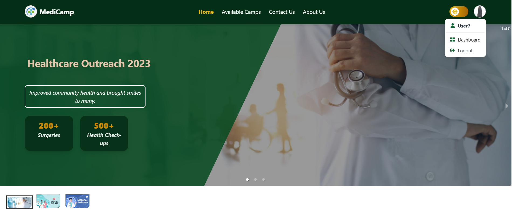

# Medical Camp Management System (MCMS)

## 📊  Project Overview

The **Medical Camp Management System (MCMS)** is a **MERN stack** web application designed to help organizers and participants efficiently manage and coordinate medical camps. The system allows **organizers** to create, manage, and track camp registrations, while **participants** can browse, register, and provide feedback. 

It includes **secure JWT authentication**, **payment integration**, **dashboard features**, and **an intuitive user experience**, and is **fully responsive** to ensure accessibility across all devices.

🚀 Live Demo: [MediCamp](https://tranquil-melomakarona-3d0816.netlify.app/)

---

## 📋 Organizers Information:
- **Password:** [adMin76#]
- **Email:** [admin76@gmail.com]

---
## 📖 Table of Contents
- [Features](#features)
- [Technology Stack](#technology-stack)
- [Prerequisites](#prerequisites)
- [Installation](#installation)
- [Configuration](#configuration)
- [Dependencies](#dependencies)
- [Admin/Organizer Dashboard](#-adminorganizer-dashboard-private-route)
- [Participant Dashboard](#-participant-dashboard-private-route)
- [Usage](#usage)
- [Live Demo](#live-demo)


---

## ✨ Features
- **User Authentication** – Secure login & registration using Firebase and JWT.  
- **Camp Registration** – Users can register for medical camps with payment integration.  
- **Feedback System** – Participants can leave reviews and ratings for camps.  
- **Search & Filters** – Advanced search, sorting, and filtering for easy camp discovery.  
- **Pagination Support** – Camps and participants are displayed with paginated views.  
- **Interactive UI** – Fully responsive design built with Tailwind CSS.  
- **Admin/Organizer Dashboard** – Organizers can manage camps, payments, and users.  
- **Participant Dashboard** – Attendees can track registrations, payments, and feedback.  
- **Payment Integration** – Secure online payments via Stripe.  
- **Notifications** – Real-time alerts via React Toastify & SweetAlert2.  
- **Data Visualization** – Dashboards with analytics and charts (Recharts).  


---


## 🛠 Technology Stack

| Category            | Technology / Library |
|---------------------|---------------------|
| **Frontend**       | React, React Router DOM, React Hook Form |
| **Backend**        | Node.js, Express.js |
| **Database**       | MongoDB |
| **Authentication** | Firebase, JWT |
| **State Management** | React Query |
| **UI Components**  | Material Tailwind, DaisyUI, Tailwind CSS |
| **Animations**     | Framer Motion, AOS |
| **Forms & Validation** | React Hook Form, React Simple Captcha |
| **Charts & Data Visualization** | Recharts |
| **Payment Integration** | Stripe |
| **Notifications**  | React Toastify, SweetAlert2 |
| **Performance**    | React Lazy Load, React Loading Skeleton |
| **Build Tool**     | Vite |
| **Linting & Formatting** | ESLint, Prettier |


---

## 🛠 Installation

### Prerequisites
Before installing and running the project, ensure you have the following installed:
- **Node.js** (v16 or later) – [Download](https://nodejs.org/)
- **NPM** or **Yarn** – Comes with Node.js installation
- **MongoDB Database** 
- **Firebase Account** – For authentication and storage
- **Stripe Account** – For payment processing


### Steps
1. **Clone the repository**

```sh
# Clone the repository
git clone https://github.com/Soraiya11-7/MediCamp-client.git

# Navigate to the project directory
cd MediCamp-client
```
2. **Install dependencies**

```sh
npm install
```
3. **Set up environment variables** (see `.env.local.example` below)

4. **Run the development server**

```sh
npm run dev
```


---

## ⚙️ Configuration (.env.local)

📌 **Create a `.env.local` file** in the root of the project and add the following:

```env
# Firebase Configuration
VITE_apiKey=your_firebase_api_key
VITE_authDomain=your_firebase_auth_domain
VITE_projectId=your_firebase_project_id
VITE_storageBucket=your_firebase_storage_bucket
VITE_messagingSenderId=your_firebase_messaging_sender_id
VITE_appId=your_firebase_app_id

# Image Hosting API Key
VITE_IMAGE_HOSTING_KEY=your_image_hosting_key

# Stripe Payment Gateway
VITE_Payment_Gateway_PK=your_stripe_payment_public_key
```
🔹 Replace `your_value_here` with your actual credentials.

🚨 Important: Never expose your .env.local file in public repositories. Use .gitignore to keep it secure.

---

## 📚 Dependencies

The Medical Camp Management System (MCMS) utilizes the following dependencies to implement key features, enhance performance, and improve the overall user experience.

### 📌 Main Dependencies
| Package                                      | Version       | Description                                                                 |
|----------------------------------------------|---------------|-----------------------------------------------------------------------------|
| `@headlessui/react`                          | ^2.2.0        | Unstyled, accessible UI components.                                          |
| `@material-tailwind/react`                   | ^2.1.10       | Material Design components built with Tailwind CSS.                         |
| `@smastrom/react-rating`                     | ^1.5.0        | React component for implementing a rating system.                           |
| `@stripe/react-stripe-js` and `@stripe/stripe-js` | ^3.1.1, ^5.5.0 | Stripe payment integration.                                                 |
| `@tanstack/react-query`                      | ^5.64.1       | Data fetching and caching library.                                          |
| `aos`                                        | ^2.3.4        | Scroll-triggered animations library.                                         |
| `axios`                                      | ^1.7.9        | HTTP client for making requests.                                            |
| `firebase`                                   | ^11.1.0       | Firebase authentication and data storage.                                   |
| `framer-motion`                              | ^12.0.0       | Library for smooth animations and transitions.                              |
| `localforage`                                | ^1.10.0       | Local storage solution.                                                     |
| `match-sorter`                               | ^8.0.0        | Sorting and filtering utility.                                              |
| `react` and `react-dom`                      | ^18.3.1       | Core React library and DOM renderer.                                        |
| `react-hook-form`                            | ^7.54.2       | Simplified form state management and validation.                            |
| `react-icons`                                | ^5.4.0        | Customizable icons for React apps.                                          |
| `react-lazyload`                             | ^3.2.1        | Enables lazy loading for images and components.                             |
| `react-loading-skeleton`                     | ^3.5.0        | Skeleton loaders for loading states.                                        |
| `react-responsive-carousel`                  | ^3.2.23       | Responsive carousel component.                                              |
| `react-router-dom`                           | ^7.1.1        | Routing library for React apps.                                             |
| `react-simple-captcha`                       | ^9.3.1        | CAPTCHA solution for form validation.                                       |
| `react-toastify`                             | ^11.0.3       | Toast notifications library.                                                |
| `recharts`                                   | ^2.15.0       | Charting library for data visualization.                                    |
| `sort-by`                                    | ^1.2.0        | Utility for sorting arrays of objects.                                      |
| `sweetalert2`                                | ^11.15.10     | Customizable alert dialogs library.                                         |
| `swiper`                                     | ^11.2.1       | Touch-enabled library for carousels and sliders.                            |


### 📌 Development Dependencies
| Package                                      | Version       | Description                                                                 |
|----------------------------------------------|---------------|-----------------------------------------------------------------------------|
| `daisyui`                                    | ^4.12.23      | Tailwind CSS component library.                                             |
| `eslint`             | ^9.17.0  | Code linting              |    |
| `tailwindcss`                                | ^3.4.17       | Utility-first CSS framework.                                                |
| `vite`                                       | ^6.0.5        | Fast build tool for React apps.                                             |


These dependencies are essential to the implementation and operation of MCMS, helping to ensure a seamless user experience, smooth performance, and integration with third-party services.

---

## 📊 Admin/Organizer Dashboard 
The **Organizer Dashboard** provides a structured interface for managing medical camps. It includes:

- **Organizer Profile** – Edit profile details like name, image, and contact info.  
- **Add A Camp** – Create camps with essential details, ensuring proper validation.  
- **Manage Camps** – View, update, or delete created camps in a structured table.  
- **Manage Registered Camps** – Track participant registrations, payment status, and cancellations  
- **Manage Registered Camps** – Track participant registrations, payment status, cancellations, and confirm enrollments.


---

## 👥 Participant Dashboard 
The **Participant Dashboard** offers a personalized experience for camp attendees:

- **Analytics** – Visual charts displaying registered camp statistics.  
- **Participant Profile** – Update personal information easily.  
- **Registered Camps** – View enrolled camps, payment status, feedback, and cancellations.  
- **Payment History** – Track transaction details for past and current camp payments.  


---


## 🎯 Usage

✔ **Admins** can create and manage medical camps through the **Admin Dashboard**.  

✔ **Participants** can register for camps and track their details in the **User Dashboard**.  

✔ **Payments** are securely processed via **Stripe**.  

✔ **Admins & Organizers** can monitor user activity, payments, and feedback. 

--- 


## 🌍 Live Demo & Repository

### 🚀 Live URL
   - Netlify: [MediCamp](https://tranquil-melomakarona-3d0816.netlify.app/)

   - Firebase: [Live Link 1](https://medical-camp-35f0f.web.app/) OR [Live Link 2](https://medical-camp-35f0f.firebaseapp.com/)

🔗 GitHub Repository: [GitHub Link](https://github.com/Soraiya11-7/MediCamp-client)

---

 🚀Efficiently manage medical camps with **MCMS**! 🏥💉🚑


